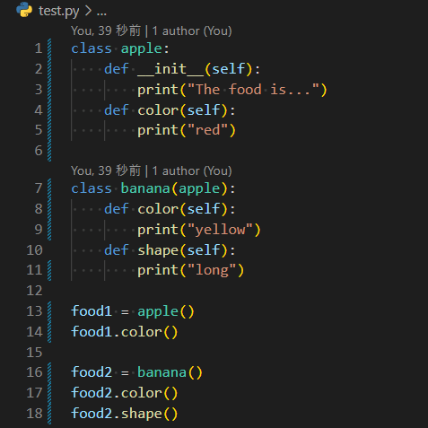
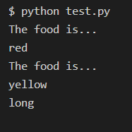

# **Class Inheritance**

Sample files for Python class inheritance using LCD_font.

## Files OverView
+ #### PG_LCD_clock.py
  File to output digital clock to pygame.
+ #### MC_LCD_clock.py
  File to output digital clock to Minecraft World.
+ #### LCDfont_5x7.txt
  Text file with 0's and 1's to represent number forms.

## About Class Inheritance
Class inheritance is the creation of a new class based on other class.
The class created by this have the same contents as the base class.
But, It is possible to rewrite the content or add content when the class inherits.
 